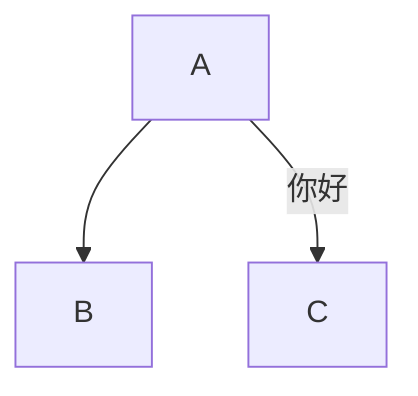
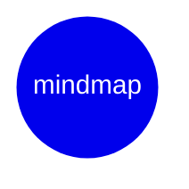

# Markdown 入门到精通<a id="one"></a>

## 一、文本格式化

### 1、加粗

<table>
	<thead>
		<caption>文本<strong>加粗</strong>语法</caption>
		<tr>
			<th>语法</th>
			<th>对应的 HTML 语法</th>
			<th>效果</th>
		</tr>
	</thead>
	<tbody>
		<tr>
			<td><code>**粗体**</code></td>
			<td rowspan="2"><code>&lt;strong&gt;粗体&lt;/strong&gt;</code></td>
			<td rowspan="2"><strong>粗体</strong></td>
		</tr>
		<tr>
			<td><code>__粗体__</code></td>
		</tr>
	</tbody>
	<tfoot>
		<tr>
			<td colspan="3">💡最佳实践：尽可能使用<code>**粗体**</code>。</td>
		</tr>
	</tfoot>
</table>

### 2、斜体

<table>
	<thead>
		<caption>文本<em>斜体</em>语法</caption>
		<tr>
			<th>语法</th>
			<th>对应的 HTML 语法</th>
			<th>效果</th>
		<tr>
	</thead>
	<tbody>
		<tr>
			<td><code>*斜体*</code></td>
			<td rowspan="2"><code>&lt;em&gt;斜体&lt;/em&gt;</code></td>
			<td rowspan="2"><em>斜体</em></td>
		</tr>
		<tr>
			<td><code>_斜体_</code></td>
		</tr>
	</tbody>
	<tfoot>
		<tr>
			<td colspan="3">💡最佳实践：尽可能使用<code>*斜体*</code>。</td>
		</tr>
	</tfoot>
</table>

### 3、删除线

<table>
	<thead>
		<caption>文本<del>删除线</del>语法</caption>
		<tr>
			<th>语法</th>
			<th>对应的 HTML 语法</th>
			<th>效果</th>
		</tr>
	</thead>
	<tbody>
		<tr>
			<td><code>~~删除线~~</code></td>
			<td><code>&lt;del&gt;删除线&lt;/del&gt;</code></td>
			<td><del>删除线</del></td>
		</tr>
	</tbody>
</table>

### 4、下划线（HTML）

<table>
	<thead>
		<caption>文本<u>下划线（HTML）</u>语法</caption>
		<tr>
			<th>语法</th>
			<th>对应的 HTML 语法</th>
			<th>效果</th>
		</tr>
	</thead>
	<tbody>
		<tr>
			<td>无</td>
			<td><code>&lt;u&gt;下划线（HTML）&lt;/u&gt;</code></td>
			<td><u>下划线（HTML）</u></td>
		</tr>
	</tbody>
</table>

### 5、高亮

<table>
	<thead>
		<caption>文本<mark>高亮</mark>语法</caption>
		<tr>
			<th>语法</th>
			<th>对应的 HTML 语法</th>
			<th>效果</th>
		</tr>
	</thead>
	<tbody>
		<tr>
			<td><code>==高亮==</code></td>
			<td><code>&lt;mark&gt;高亮&lt;/mark&gt;</code></td>
			<td><mark>高亮</mark></td>
		</tr>
	</tbody>
</table>

### 6、字体、字号和颜色（样式化）（HTML）

<table>
	<thead>
		<caption>文本<font face="楷体">字体</font>、<font size="6">字号</font>和<font color="green">颜色</font>（样式化）（HTML）语法</caption>
		<tr>
			<th>样式</th>
			<th>语法</th>
			<th>对应的 HTML 语法</th>
			<th>效果</th>
		</tr>
	</thead>
	<tbody>
		<tr>
			<td><font face="楷体">字体</font></td>
			<td>无</td>
			<td><code>&lt;font face="楷体"&gt;字体&lt;/font&gt;</code></td>
			<td rowspan="3">⬅️见第一列</td>
		</tr>
		<tr>
			<td><font size="6">字号</font></td>
			<td>无</td>
			<td><code>&lt;font size="6"&gt;字号&lt;/font&gt;</code></td>
		</tr>
		<tr>
			<td><font color="green">颜色</font></td>
			<td>无</td>
			<td><code>&lt;font color="green"&gt;颜色&lt;/font&gt;</code></td>
		</tr>
	</tbody>
</table>

## 二、链接

<table>
	<thead>
		<caption><a href="https://www.markdownguide.org/basic-syntax/#links">链接</a>语法</caption>
		<tr>
			<th>语法</th>
			<th>对应的 HTML 语法</th>
			<th>效果</th>
		</tr>
	</thead>
	<tbody>
		<tr>
			<td><code>全球最大的开发者社区：[GitHub](https://github.com)。</code></td>
			<td><code>全球最大的开发者社区：&lt;a href="https://github.com"&gt;GitHub&lt;/a&gt;。</code></td>
			<td>全球最大的开发者社区：<a href="https://github.com">GitHub</a>。</td>
		</tr>
	</tbody>
</table>

### 1、链接的 title

鼠标悬停在链接上时的提示文本。

<table>
	<thead>
		<caption><a href="https://www.markdownguide.org/basic-syntax/#adding-titles" title="adding-titles | www.markdownguide.org">链接 title</a> 语法</caption>
		<tr>
			<th>语法</th>
			<th>对应的 HTML 语法</th>
			<th>效果</th>
		</tr>
	</thead>
	<tbody>
		<tr>
			<td><code>[GNU](https://www.gnu.org "伟大，无需多言。")。</code></td>
			<td><code>&lt;a href="https://www.gnu.org" title="伟大，无需多言。"&gt;GNU&lt;/a&gt;。</code></td>
			<td><a href="https://www.gnu.org" title="伟大，无需多言。">GNU</a>。</td>
		</tr>
	</tbody>
</table>

### 2、字面 url

字面 url，不同于超链接，将文本指向一个 url，而是将 url 原样写出来。

<table>
	<thead>
		<caption>字面 url 语法</caption>
		<tr>
			<th>语法</th>
			<th>对应的 HTML 语法</th>
			<th>效果</th>
		</tr>
	</thead>
	<tbody>
		<tr>
			<td><code>&lt;https://www.markdownguide.org/&gt;。</code></td>
			<td><code>&lt;a href="https://www.markdownguide.org/"&gt;https://www.markdownguide.org/&lt;/a&gt;。</code></td>
			<td><a href="https://www.markdownguide.org/">https://www.markdownguide.org/</a>。</td>
		</tr>
	</tbody>
</table>

### 3、邮箱链接

<table>
	<thead>
		<caption>邮箱链接语法</caption>
		<tr>
			<th>语法</th>
			<th>对应的 HTML 语法</th>
			<th>效果</th>
		</tr>
	</thead>
	<tbody>
		<tr>
			<td><code>&lt;gnu@gnu.org&gt;。</code></td>
			<td><code>&lt;a href="mailto:gnu@gnu.org"&gt;gnu@gnu.org&lt;/a&gt;。</code></td>
			<td><a href="mailto:gnu@gnu.org">gnu@gnu.org</a>。</td>
		</tr>
	</tbody>
</table>

## 三、图像

<table>
	<thead>
		<caption>图像语法</caption>
		<tr>
			<th>语法</th>
			<th>对应的 HTML 语法</th>
			<th>效果</th>
		</tr>
	</thead>
	<tbody>
		<tr>
			<td><code></code></td>
			<td><code>&lt;img src="https://www.gnu.org/graphics/gerwinski-gnu-head.png" alt="GNU Logo" /&gt;</code></td>
			<td></td>
		</tr>
	</tbody>
</table>

### 1、图像 title

同链接。

### 2、图像链接

<table>
	<thead>
		<caption>图像链接语法</caption>
		<tr>
			<th>语法</th>
			<th>对应的 HTML 语法</th>
			<th>效果</th>
		</tr>
	</thead>
	<tbody>
		<tr>
			<td><code>[](https://www.gnu.org/)</code></td>
			<td><code>&lt;a href="https://www.gnu.org/"&gt;&lt;img src="https://www.gnu.org/graphics/gerwinski-gnu-head.png" alt="GNU Logo" /&gt;&lt;/a&gt;</code></td>
			<td><a href="https://www.gnu.org/"></a></td>
		</tr>
	</tbody>
</table>

## 四、引用块

<table>
	<thead>
		<caption>引用块语法</caption>
		<tr>
			<th>语法</th>
			<th>对应的 HTML 语法</th>
			<th>效果</th>
		</tr>
	</thead>
	<tbody>
		<tr>
			<td><code>&gt; GNU's Not Unix!</code></td>
			<td><code>&lt;blockquote&gt;GNU's Not Unix!&lt;/blockquote&gt;</code></td>
			<td><blockquote>GNU's Not Unix!</blockquote></td>
		</tr>
	</tbody>
</table>

## 五、列表

### 1、有序列表

<table>
	<thead>
		<caption>有序列表语法</caption>
		<tr>
			<th>语法</th>
			<th>对应的 HTML 语法</th>
			<th>效果</th>
		</tr>
	</thead>
	<tbody>
		<tr>
			<td><pre><code class='language-markdown' lang='markdown'>
</code></pre>


	</td>
			<td><code>&lt;ul</code></td>
			<td><blockquote>GNU's Not Unix!</blockquote></td>
		</tr>
	</tbody>
</table>

1. Python
2. C/C++

<ol>
<li>C/C++</li>

</ol>
<pre><code class='language-markdown' lang='markdown'>编写程序的 7 个步骤：

1. 定义程序的目标；
2. 设计程序；
3. 编写代码；
4. 编译；
5. 运行程序
6. 测试和调试
7. 维护和修改
</code></pre>
<p>&nbsp;</p>


```markdown
编写程序的 7 个步骤：

1. 定义程序的目标；
2. 设计程序；
3. 编写代码；
4. 编译；
5. 运行程序
6. 测试和调试
7. 维护和修改
```


### 2、无序列表

- React
- Vue
- Astro

## 分割线

---

## 代码

### 行内代码

`printf("Hello, world!\n");`

``

### 代码块

```c
#include <stdio.h>

int main(void) {
	printf("Hello, world!\n");
	return 0;
}
```

## 进阶语法

### 转义字符

\`\*\*重要内容\*\*\`

\\\`\*\*重要内容\*\*\`\\

`\`

### 表格

| 网站 | 说明 |
| ---: | :--- |
| [GitHub](https://github.com) | 全球最大的开发者社区。 |
| [GNU](https://www.gnu.com) | GNU's Not Unix! |

#### 表格的跨行跨列（HTML）

<table
    border="1"
    cellspacing="0"
    cellpadding="5"
>
    <caption>
        版本规划任务分配表
    </caption>
    <tr>
        <th colspan="2">需求：V0.3版本规划</th>
        <th>优先级</th>
        <th>任务分解</th>
        <th>产品负责人</th>
    </tr>
    <tr>
        <td rowspan="3">功能模块1</td>
        <td>具体事项1</td>
        <td>3</td>
        <td>任务1</td>
        <td rowspan="3">@翠花</td>
    </tr>
    <tr>
        <td rowspan="2">具体事项2</td>
        <td>4</td>
        <td>任务2</td>
    </tr>
    <tr>
        <td>1</td>
        <td>任务3</td>
    </tr>
    <tr>
        <td rowspan="6">功能模块2</td>
        <td>具体事项1</td>
        <td>2</td>
        <td>任务1</td>
        <td rowspan="6"></td>
    </tr>
    <tr>
        <td rowspan="4">具体事项2</td>
        <td>3</td>
        <td>任务1</td>
    </tr>
    <tr>
        <td>2</td>
        <td>任务2</td>
    </tr>
    <tr>
        <td>1</td>
        <td>任务3</td>
    </tr>
    <tr>
        <td>4</td>
        <td>任务4</td>
    </tr>
    <tr>
        <td>具体事项3</td>
        <td>1</td>
        <td>任务1</td>
    </tr>
    <tr>
        <th colspan="5">备注信息</th>
    </tr>
    <tr>
        <td colspan="5">...</td>
    </tr>
</table>

### 脚注

GNU/Linux[^1] 是一个伟大的开源项目。

[^1]:GNU/Linux refers to an operating system that combines the GNU Project's software components with the Linux kernel. 

### 上下标

上标：x^2^

下标：H~2~O

### 待办列表

- [ ] 任务 1 
- [ ] 任务 2 
- [ ] 任务 3 
- [ ] 任务 4 


### 锚点


- [1.Markdown 入门到精通](#one)


### 内容目录

[TOC]

## 高级语法

### 1、LaTeX 数学公式

#### 1.1、行内公式

$E=mc^2$

#### 1.2、块级公式

$$
E=mc^2
$$

#### 1.3、常用 LaTeX 语法

- 上标与下标：`^` 表示上标，`_` 表示下标。

$x_i^2$

- 分式 ：`\frac{}{}`

$\frac{1}{2}$

- 根号：`\sqrt{}`

$\sqrt{x^2+y^2}$

- 求和：`\sum{}`

$\sum_{i=1}^{n} i^2$

- 积分：`\int{}`

$\int_{0}^{\infty} e^{-x} dx$

- 矩阵：`\begin{matrix}` 矩阵内容 `\end{matrix}`

$$
\begin{matrix}
a & b & c \\
d & e & f \\
g & h & i
\end{matrix}
$$

### 2、Emoji

😄

:angry:

:+1:

:smile:

:heart:

:smiley:


### 3、流程图






徽章

